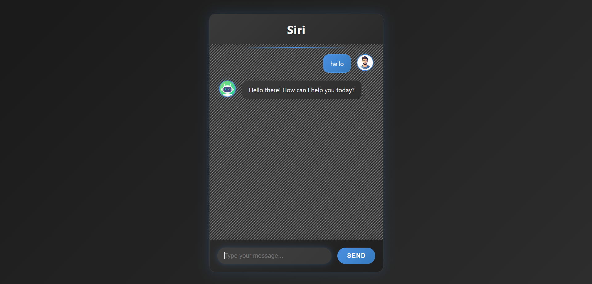

# 🤖 AI ChatBot Frontend

A sleek and modern **AI ChatBot** user interface built using **HTML**, **CSS**, and **JavaScript**.  
This project simulates the front-end behavior of a real AI chatbot where users can send messages and receive auto-responses. It's perfect for showcasing UI/UX skills and practicing dynamic DOM manipulation.

---

## 🧩 Features

- ✅ Clean and responsive chatbot interface
- ✅ Dynamic message sending and response simulation
- ✅ Scrollable chat window
- ✅ Typing animation effect (optional)
- ✅ Mobile-friendly design
- ✅ Modular, readable codebase

---

## 🛠️ Tech Stack

- **HTML5** – for semantic and accessible structure  
- **CSS3** – for custom styling and responsive layout  
- **JavaScript** – for interactivity and dynamic message rendering

---

## 📸 Screenshots

  
*Responsive chatbot on desktop*

  
*Smooth UI on mobile screens*

---

## 📁 Folder Structure

ai-chatbot/
├── assets/
│ ├── icons/
│ └── images/
├── index.html
├── style.css
├── script.js
└── README.md

---

💡 Future Improvements
Integrate with real AI backend (like OpenAI, Gemini, etc.)

Store chat history in localStorage

Add voice input using Web Speech API

Display typing indicator and time stamps

🙋‍♂️ Author
Gautam Kumar Jha
Frontend Developer | Tech Enthusiast | Open Source Learner
[📫 LinkedIn](https://www.linkedin.com/in/gautam-jha-77111634b/)

## 🚀 How to Run Locally

1. **Clone this repository**
   ```bash
   git clone https://github.com/Gautamjha321/ai-chatbot.git
   cd ai-chatbot


